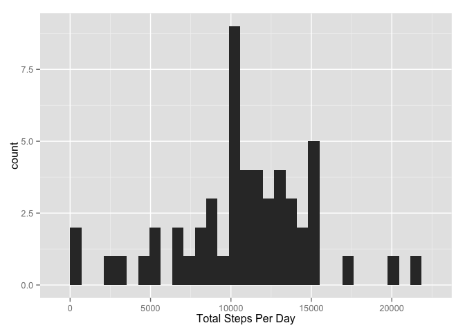
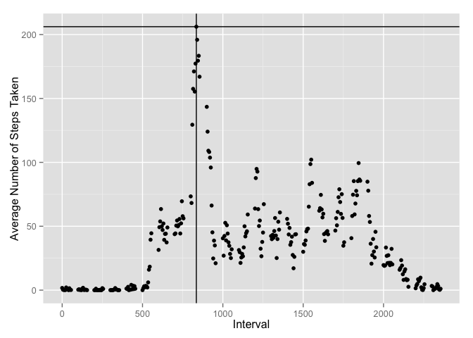
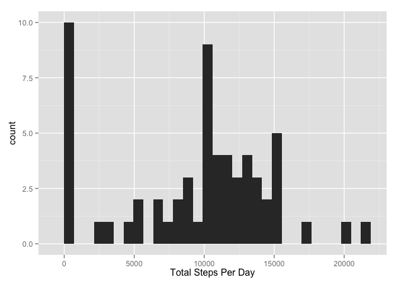
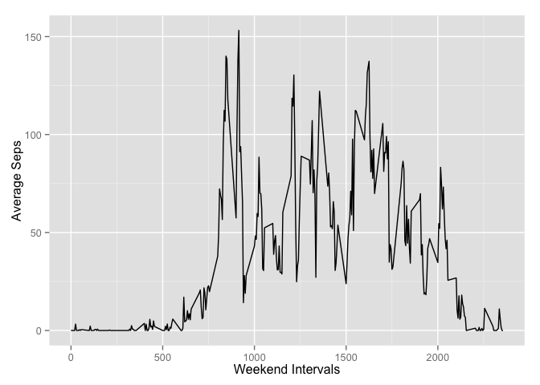
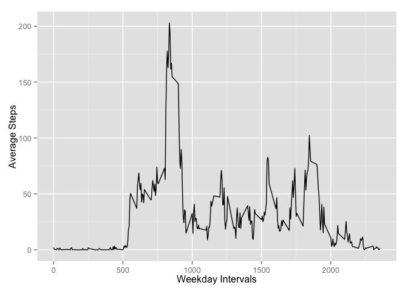

# Reproducible Research: Peer Assessment 1 (Prabath Peiris)

### Loading and preprocessing the data


```r
dataset <- read.csv('activity.csv', header=TRUE, sep=",", na.strings = "NA")
head(dataset)
```

```
##   steps       date interval
## 1    NA 2012-10-01        0
## 2    NA 2012-10-01        5
## 3    NA 2012-10-01       10
## 4    NA 2012-10-01       15
## 5    NA 2012-10-01       20
## 6    NA 2012-10-01       25
```

What is the total number of steps taken per day?
Remove NA values from the steps variable (column)


```r
rawdata <- dataset
dataset <- dataset[!is.na(dataset$steps), ]
dataset <- dataset[!is.na(dataset$date), ]
head(dataset)
```

```
##     steps       date interval
## 289     0 2012-10-02        0
## 290     0 2012-10-02        5
## 291     0 2012-10-02       10
## 292     0 2012-10-02       15
## 293     0 2012-10-02       20
## 294     0 2012-10-02       25
```

Group the dataset dy date


```r
gdata <- group_by(dataset, date)
head(gdata)
```

```
## Source: local data frame [6 x 3]
## Groups: date [1]
## 
##   steps       date interval
##   (int)     (fctr)    (int)
## 1     0 2012-10-02        0
## 2     0 2012-10-02        5
## 3     0 2012-10-02       10
## 4     0 2012-10-02       15
## 5     0 2012-10-02       20
## 6     0 2012-10-02       25
```

Summarise the data by date with total number of steps per given day


```r
total_steps <- summarise(gdata, tsteps = sum(steps))
head(total_steps)
```

```
## Source: local data frame [6 x 2]
## 
##         date tsteps
##       (fctr)  (int)
## 1 2012-10-02    126
## 2 2012-10-03  11352
## 3 2012-10-04  12116
## 4 2012-10-05  13294
## 5 2012-10-06  15420
## 6 2012-10-07  11015
```

Plot the hisogram for total number of steps


```r
plt <- qplot(tsteps, data = total_steps, geom="histogram")
plt <- plt + labs(x = "Total Steps Per Day")
plt
```

```
## stat_bin: binwidth defaulted to range/30. Use 'binwidth = x' to adjust this.
```

 

### What is the mean total number of steps taken per day?


```r
mtotal <- sum(total_steps$tsteps)/nrow(total_steps)
mtotal <- format(mtotal, digits = 2)
```

Mean total number of steps taken per dat is 10766

What is the median total number of steps taken per day?


```r
medsteps <- median(total_steps$tsteps)
medsteps <- format(medsteps, digits = 2)
```

Median total number of steps taken per dat is 10765

## What is the average daily activity pattern?


Which 5-minute interval, on average across all the days in the dataset, contains the maximum number of steps?
Group the data set by interval and calculate the average number of steps per interval


```r
gidata <- group_by(dataset, interval)
sdata <- summarise(gidata, avesteps = mean(steps))
plot2 <- qplot(interval, avesteps, type="l", data = sdata)
plot2 <- plot2 + labs(x = "Interval")
plot2 <- plot2 + labs(y = "Average Number of Steps Taken")
maxInterval <- sdata[sdata$avesteps == max(sdata$avesteps),]$interval
plot2 + geom_vline(xintercept = maxInterval) + geom_hline(yintercept = max(sdata$avesteps))
```

 

Maximum number of average steps take at interval 835


```r
comp <- complete.cases(rawdata)
countnotcompelte <- length(comp[comp == FALSE])
```


Total number of rows that is not complete is 2304

## Imputing missing values

Filling all the NA values with zero

```r
fillNAdata <-rawdata
fillNAdata[which(is.na(fillNAdata$steps)), ]$steps <- 0

gfillNAdata <- group_by(fillNAdata, date)
total_gfillNAdata <- summarise(gfillNAdata, tsteps = sum(steps))
plt3 <- qplot(tsteps, data = total_gfillNAdata, geom="histogram")
plt3 <- plt3 + labs(x = "Total Steps Per Day")
plt3
```

```
## stat_bin: binwidth defaulted to range/30. Use 'binwidth = x' to adjust this.
```

 


```r
mNAtotal <- sum(total_gfillNAdata$tsteps)/nrow(total_gfillNAdata)
mNAtotal <- format(mNAtotal, digits = 2)
```
Mean total number of steps taken per dat is 9354


```r
meNAdsteps <- median(total_gfillNAdata$tsteps)
meNAdsteps <- format(meNAdsteps, digits = 2)
```

Median total number of steps taken per dat is 10395

By altering the NA values in the data set, the median and mean value has changed

## Are there differences in activity patterns between weekdays and weekends?

Are there differences in activity patterns between weekdays and weekends?


```r
fillNAdata$date <- as.Date(fillNAdata$date)
weekdays1 <- c('Monday', 'Tuesday', 'Wednesday', 'Thursday', 'Friday')
fillNAdata$day <- factor((weekdays(fillNAdata$date) %in% weekdays1), levels=c(FALSE, TRUE), labels=c('weekend', 'weekday'))
weekendData <- fillNAdata[fillNAdata$day == "weekend", ]
weekdataData <- fillNAdata[fillNAdata$day == "weekday", ]
gweekendData <- group_by(weekendData, interval)
sgweekendData <- summarise(gweekendData, avesteps = mean(steps))
gweekdataData <- group_by(weekdataData, interval)
sgweekdataData <- summarise(gweekdataData, avesteps = mean(steps))
```

Weekend Data

```r
plt4 <- qplot(interval, avesteps, type="l", data = sgweekendData, geom="line")
plt4 <- plt4 + labs(x = "Weekend Intervals") + labs(y = "Average Seps")
plt4
```

 

Weekday Data

```r
plt5 <- qplot(interval, avesteps, type="l", data = sgweekdataData, geom="line")
plt5 <- plt5 + labs(x = "Weekday Intervals") + labs(y = "Average Steps")
plt5
```

 
