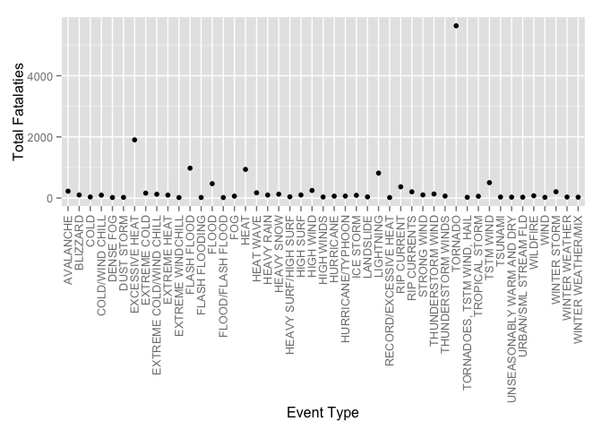
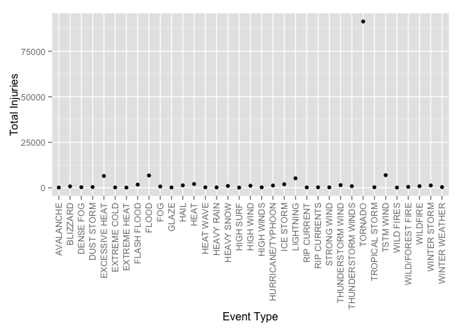
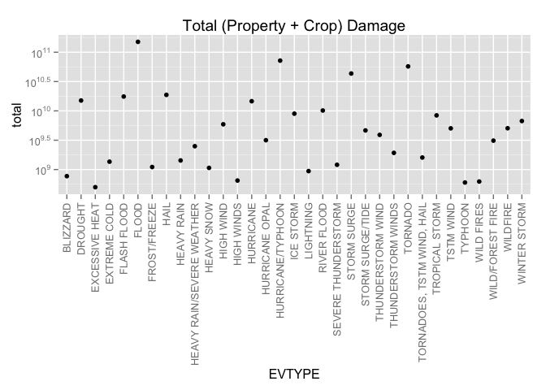

# Most Harmful Weather Events Respect to Population Health and Greatest Economic Consequences in United States Between 1950 and 2011


#### Synopsis
In this report we aim to describe the severe weather events impact on public health and economic problems for communities and municipalities in the United States between the years 1950 and 2011.The public health and the economic impacts are address in two separate sections in this report. In order to analysis these events we obtained U.S. National Oceanic and Atmospheric Administration's (NOAA) storm database. Analysis of this report show 'Tornado' is the major impact on public health including fatalities and injuries. Flooding is the most impacted weather event in the US economy.

#### Data Processing

We obtain [data](https://d396qusza40orc.cloudfront.net/repdata%2Fdata%2FStormData.csv.bz2) from U.S. National Oceanic and Atmospheric Administration's (NOAA) storm database for this analysis. There are [data dictionaries](https://d396qusza40orc.cloudfront.net/repdata%2Fpeer2_doc%2Fpd01016005curr.pdf) and [FAQ](https://d396qusza40orc.cloudfront.net/repdata%2Fpeer2_doc%2FNCDC%20Storm%20Events-FAQ%20Page.pdf) for further reading about this data set also available.

##### Reading data

The Original data set come as bz2 compress format. After decompressing the data set you can find a comma separated csv file named 'repdata-data-StormData.csv'. These data being loaded to R data frame as follows.


```r
data <- read.csv('repdata-data-StormData.csv', na.strings = "NA")
```

After reading the data set, check the structure of the data set.This give us complete picture of the data frame format including column names and their types. This data set contain total 902297 observations and 37 column variables.


```r
str(data)
```

```
## 'data.frame':	902297 obs. of  37 variables:
##  $ STATE__   : num  1 1 1 1 1 1 1 1 1 1 ...
##  $ BGN_DATE  : Factor w/ 16335 levels "1/1/1966 0:00:00",..: 6523 6523 4242 11116 2224 2224 2260 383 3980 3980 ...
##  $ BGN_TIME  : Factor w/ 3608 levels "00:00:00 AM",..: 272 287 2705 1683 2584 3186 242 1683 3186 3186 ...
##  $ TIME_ZONE : Factor w/ 22 levels "ADT","AKS","AST",..: 7 7 7 7 7 7 7 7 7 7 ...
##  $ COUNTY    : num  97 3 57 89 43 77 9 123 125 57 ...
##  $ COUNTYNAME: Factor w/ 29601 levels "","5NM E OF MACKINAC BRIDGE TO PRESQUE ISLE LT MI",..: 13513 1873 4598 10592 4372 10094 1973 23873 24418 4598 ...
##  $ STATE     : Factor w/ 72 levels "AK","AL","AM",..: 2 2 2 2 2 2 2 2 2 2 ...
##  $ EVTYPE    : Factor w/ 985 levels "   HIGH SURF ADVISORY",..: 834 834 834 834 834 834 834 834 834 834 ...
##  $ BGN_RANGE : num  0 0 0 0 0 0 0 0 0 0 ...
##  $ BGN_AZI   : Factor w/ 35 levels "","  N"," NW",..: 1 1 1 1 1 1 1 1 1 1 ...
##  $ BGN_LOCATI: Factor w/ 54429 levels ""," Christiansburg",..: 1 1 1 1 1 1 1 1 1 1 ...
##  $ END_DATE  : Factor w/ 6663 levels "","1/1/1993 0:00:00",..: 1 1 1 1 1 1 1 1 1 1 ...
##  $ END_TIME  : Factor w/ 3647 levels ""," 0900CST",..: 1 1 1 1 1 1 1 1 1 1 ...
##  $ COUNTY_END: num  0 0 0 0 0 0 0 0 0 0 ...
##  $ COUNTYENDN: logi  NA NA NA NA NA NA ...
##  $ END_RANGE : num  0 0 0 0 0 0 0 0 0 0 ...
##  $ END_AZI   : Factor w/ 24 levels "","E","ENE","ESE",..: 1 1 1 1 1 1 1 1 1 1 ...
##  $ END_LOCATI: Factor w/ 34506 levels ""," CANTON"," TULIA",..: 1 1 1 1 1 1 1 1 1 1 ...
##  $ LENGTH    : num  14 2 0.1 0 0 1.5 1.5 0 3.3 2.3 ...
##  $ WIDTH     : num  100 150 123 100 150 177 33 33 100 100 ...
##  $ F         : int  3 2 2 2 2 2 2 1 3 3 ...
##  $ MAG       : num  0 0 0 0 0 0 0 0 0 0 ...
##  $ FATALITIES: num  0 0 0 0 0 0 0 0 1 0 ...
##  $ INJURIES  : num  15 0 2 2 2 6 1 0 14 0 ...
##  $ PROPDMG   : num  25 2.5 25 2.5 2.5 2.5 2.5 2.5 25 25 ...
##  $ PROPDMGEXP: Factor w/ 19 levels "","-","?","+",..: 17 17 17 17 17 17 17 17 17 17 ...
##  $ CROPDMG   : num  0 0 0 0 0 0 0 0 0 0 ...
##  $ CROPDMGEXP: Factor w/ 9 levels "","?","0","2",..: 1 1 1 1 1 1 1 1 1 1 ...
##  $ WFO       : Factor w/ 542 levels ""," CI","%SD",..: 1 1 1 1 1 1 1 1 1 1 ...
##  $ STATEOFFIC: Factor w/ 250 levels "","ALABAMA, Central",..: 1 1 1 1 1 1 1 1 1 1 ...
##  $ ZONENAMES : Factor w/ 25112 levels "","                                                                                                                               "| __truncated__,..: 1 1 1 1 1 1 1 1 1 1 ...
##  $ LATITUDE  : num  3040 3042 3340 3458 3412 ...
##  $ LONGITUDE : num  8812 8755 8742 8626 8642 ...
##  $ LATITUDE_E: num  3051 0 0 0 0 ...
##  $ LONGITUDE_: num  8806 0 0 0 0 ...
##  $ REMARKS   : Factor w/ 436781 levels "","\t","\t\t",..: 1 1 1 1 1 1 1 1 1 1 ...
##  $ REFNUM    : num  1 2 3 4 5 6 7 8 9 10 ...
```

#### Question 1: Across the United States, which types of events are most harmful with respect to population health?

In order to answer this question we hand pick the column variables that are only required for this analysis. Also take a look at the first couple of rows in the data set.


```r
datalimit <- data[, c("EVTYPE", "FATALITIES", "INJURIES")]
head(datalimit)
```

```
##    EVTYPE FATALITIES INJURIES
## 1 TORNADO          0       15
## 2 TORNADO          0        0
## 3 TORNADO          0        2
## 4 TORNADO          0        2
## 5 TORNADO          0        2
## 6 TORNADO          0        6
```

Since "EVTYPE" field contain all the events, we group the entire data set by this field and summarized it We are calculate the total number of injuries and total number of deaths per weather event. 


```r
gdatalimit <- group_by(datalimit, EVTYPE)
totals <- summarise(
    gdatalimit, 
    tinjuries = sum(INJURIES),  
    tfata=sum(FATALITIES)
  )
totaldeaths = max(totals$tfata)
totalinjuries = max(totals$tinjuries)
```

#### Results

In order to understand what event causes the most fatalities, we plot total deaths vs event type plot as follows. Since this data set contain large number of event types, we only plot the data that are above average death counts. This makes the plot more readable. It is clear that Tornado are the worst weather event that caused the most deaths between 1950 and 2011 in US (total deaths 5633). 


```r
fatals <- totals[totals$tfata > mean(totals$tfata), ]
plot1 <- qplot(EVTYPE, tfata, data = fatals)
plot1 <- plot1 + theme(axis.text.x=element_text(angle = 90, vjust = 0.5, hjust=1))
plot1 + labs(y = "Total Fatalaties") + labs(x = "Event Type")
```

 


In order to understand what event causes the most injuries, we plot total injuries vs event type plot as follows. Since the data set contain large number of event types, we only plot the total injuries that are above the average count. This makes the plot more readable. It is clear Tornado are the worst weather event that caused most injuries between 1950 and 2011 in US (total injuries 91346)


```r
injdf <- totals[totals$tinjuries > mean(totals$tinjuries), ]
plot2 <- qplot(EVTYPE, tinjuries, data = injdf)
plot2 <- plot2 + theme(axis.text.x=element_text(angle = 90, vjust = 0.5, hjust=1))
plot2 + labs(y = "Total Injuries") + labs(x = "Event Type")
```

 

#### Conclusion for question 1

It is very clear that Tornado are the worst weather event impact the public health in the US.


#### Question 2: Across the United States, which types of events have the greatest economic consequences?

In order to answer this question, we pick the column variables that are only required for this analysis. 


```r
datal <- data[, c("EVTYPE", "PROPDMG", "PROPDMGEXP", "CROPDMG", "CROPDMGEXP")]
head(datal)
```

```
##    EVTYPE PROPDMG PROPDMGEXP CROPDMG CROPDMGEXP
## 1 TORNADO    25.0          K       0           
## 2 TORNADO     2.5          K       0           
## 3 TORNADO    25.0          K       0           
## 4 TORNADO     2.5          K       0           
## 5 TORNADO     2.5          K       0           
## 6 TORNADO     2.5          K       0
```

We have add 3 separate additional columns to this data frame. The fields 'PROPDMGEXP_V' and CROPDMGEXP_V contain the numeric conversion factor for "Killo (K)", "Million (M)" and "Billion (B)" for column 'PROPDMGEXP' and 'CROPDMGEXP'. Field PROPCROPDMG will contain the calculated total damage amount.


```r
datal$PROPDMGEXP_V = 0.0
datal$CROPDMGEXP_V = 0.0
datal$PROPCROPDMG = 0.0

datal[datal$PROPDMGEXP == 'K', ]$PROPDMGEXP_V = 1000
datal[datal$PROPDMGEXP == 'M', ]$PROPDMGEXP_V = 1000000
datal[datal$PROPDMGEXP == 'B', ]$PROPDMGEXP_V = 1000000000

datal[datal$CROPDMGEXP == 'K', ]$CROPDMGEXP_V = 1000
datal[datal$CROPDMGEXP == 'M', ]$CROPDMGEXP_V = 1000000
datal[datal$CROPDMGEXP == 'B', ]$CROPDMGEXP_V = 1000000000
```

Here we compute the total damage including property and crop damages and record the final value in "PROPCROPDMG" field, also remove temporary created conversion fields.


```r
datal$PROPCROPDMG = 
  (datal$PROPDMGEXP_V * datal$PROPDMG) + 
  (datal$CROPDMGEXP_V * datal$CROPDMG)

datal$PROPDMGEXP_V <- NULL
datal$CROPDMGEXP_V <- NULL
```

#### Results

We group the enter data frame by event types and plot the total damage vs event types as follows. The y axis of this plot is scaled with log10 to make it simple to read and understand the data. Also plotted only data that are above average for the simplicity.


```r
gdatal <- group_by(datal, EVTYPE)
head(gdatal)
```

```
## Source: local data frame [6 x 6]
## Groups: EVTYPE [1]
## 
##    EVTYPE PROPDMG PROPDMGEXP CROPDMG CROPDMGEXP PROPCROPDMG
##    (fctr)   (dbl)     (fctr)   (dbl)     (fctr)       (dbl)
## 1 TORNADO    25.0          K       0                  25000
## 2 TORNADO     2.5          K       0                   2500
## 3 TORNADO    25.0          K       0                  25000
## 4 TORNADO     2.5          K       0                   2500
## 5 TORNADO     2.5          K       0                   2500
## 6 TORNADO     2.5          K       0                   2500
```

```r
dmgtotals <- summarise(gdatal, total = sum(PROPCROPDMG))
ggdatal <- dmgtotals[dmgtotals$total >mean(dmgtotals$total),]
plot3 <- qplot(EVTYPE, total, data = ggdatal)
plot3 <- plot3 + ggtitle("Total (Property + Crop) Damage")
plot3 <- plot3 + theme(axis.text.x=element_text(angle = 90, vjust = 0.5, hjust=1))
plot3 + scale_y_log10(breaks = trans_breaks("log10", function(x) 10^x),
              labels = trans_format("log10", math_format(10^.x)))
```

 

#### Conclusion for question 2

It is clear that Flood weather event is the one that caused most economical damage in US between 1950 and 2011.


